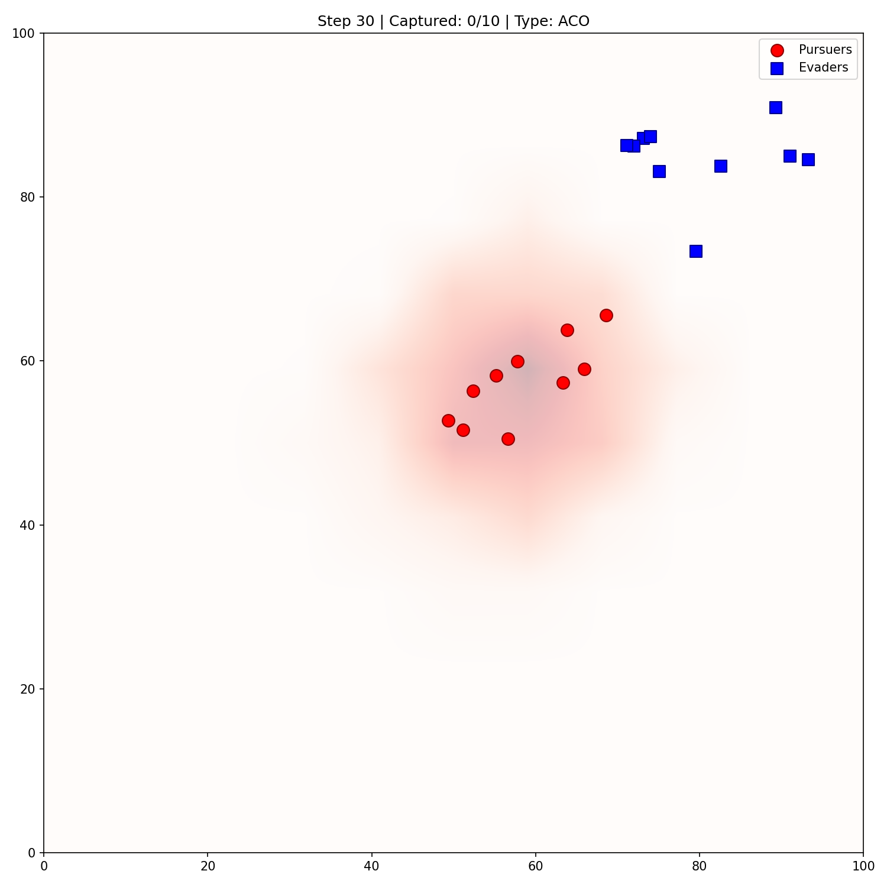

# The Hunters and the Hive

A swarm robotics simulation comparing **Particle Swarm Optimization (PSO)** and **Ant Colony Optimization (ACO)** strategies for pursuit-evasion scenarios.

 

## Overview

This project simulates a pursuit-evasion game where:
- **Pursuers (Hunters)** - Use PSO to locate and capture evaders
- **Evaders (The Hive)** - Can use either ACO or PSO strategies to evade capture

The simulation explores how different swarm intelligence algorithms perform in various environmental conditions.

## Features

- **Two Evader Strategies**: ACO (pheromone-based) or PSO (particle swarm)
- **Three Environment Types**: Open field, sparse obstacles, dense maze
- **Configurable Parameters**: Swarm size, inertia, sensing radius, speeds
- **Experiment Framework**: Automated parameter sensitivity, environmental complexity, and scalability analysis
- **Visualization**: Real-time animation and snapshot capture

## Installation

### Prerequisites

- Python 3.8 or higher
- pip package manager

### Setup

1. **Clone the repository**:
   ```bash
   git clone https://github.com/yourusername/the-hunters-and-the-hive.git
   cd the-hunters-and-the-hive
   ```

2. **Create a virtual environment** (recommended):
   ```bash
   python -m venv venv
   source venv/bin/activate  # On Windows: venv\Scripts\activate
   ```

3. **Install dependencies**:
   ```bash
   pip install -r requirements.txt
   ```

## Quick Start

### Running a Simple Simulation

```bash
python swarm_pursuit_evasion_3.py
```

This opens a visualization window showing pursuers (red circles) hunting evaders (blue squares) in an open field.

### Running Experiments

```bash
# Run all experiments
python planned_experiments.py

# Run specific experiments
python planned_experiments.py --experiments 1 2 3

# Run with fewer repetitions for quick testing
python planned_experiments.py --experiments 1 --n-runs 5
```

## Project Structure

```
the-hunters-and-the-hive/
├── swarm_pursuit_evasion_3.py   # Main simulation engine
├── planned_experiments.py       # Experiment framework
├── requirements.txt            # Python dependencies
├── README.md                    # This file
├── MANUAL.md                    # Detailed usage manual
├── experiment_results/         # Generated experiment data
│   ├── snapshots/              # Visualization snapshots
│   ├── experiment1_parameter_sensitivity.json
│   ├── experiment2_environmental_complexity.json
│   └── experiment3_scalability.json
└── .gitignore
```

## Configuration

Key parameters in `SimulationConfig`:

| Parameter | Default | Description |
|-----------|---------|-------------|
| `world_size` | (100, 100) | Field dimensions |
| `n_pursuers` | 5 | Number of pursuers |
| `n_evaders` | 3 | Number of evaders |
| `pursuer_max_speed` | 2.0 | Pursuer maximum velocity |
| `evader_max_speed` | 1.8 | Evader maximum velocity |
| `pursuer_inertia` | 0.7 | PSO inertia weight |
| `evader_type` | "ACO" | "ACO" or "PSO" |

## Experiment Results

The project includes three experiments:

### Experiment 1: Parameter Sensitivity
- Swarm size: 3, 5, 10 agents
- Inertia: 0.4, 0.6, 0.8
- Sensing radius: 20, 30, 50 units

### Experiment 2: Environmental Complexity
- Open field (no obstacles)
- Sparse obstacles (4 obstacles)
- Dense maze (11 obstacles)

### Experiment 3: Scalability
- 1:1 pursuer-to-evader ratio
- 2:1 ratio (more pursuers)
- 1:2 ratio (more evaders)

## Sample Results

| Scenario | Evader | Capture Rate | Avg Survival |
|----------|--------|--------------|--------------|
| Open Field | ACO | ~78% | ~133 steps |
| Open Field | PSO | ~85% | ~110 steps |
| Sparse Obstacles | ACO | ~72% | ~150 steps |
| Dense Maze | ACO | ~45% | ~280 steps |

See `MANUAL.md` for detailed usage instructions and `experiment_results/` for complete data.

## License

MIT License

## Citation

If you use this code in your research, please cite:

```
The Hunters and the Hive - Swarm Pursuit-Evasion Simulation
```

## Contributing

Contributions welcome! Please open an issue or submit a pull request.
